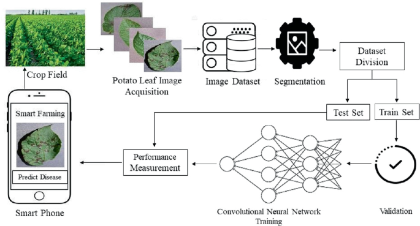

# Potato Disease Classifier

This project is a simple web application built with **FastAPI** that uses a pre-trained deep learning model to classify potato diseases. The application can identify the following conditions:

1. **Early Blight**
2. **Late Blight**
3. **Healthy**

This application helps in early detection of diseases, which is crucial for farmers to take timely action to protect their crops.

## Images

<div align="center" style="display: flex; flex-wrap: wrap; justify-content: center; gap: 10px;">
    
</div>

## Project Structure

The project directory is organized as follows:

```plaintext
.
├── README.md          # Documentation file explaining the project, setup, and usage.
├── main.py            # The main Python script containing the FastAPI application.
├── model.h5           # The pre-trained deep learning model for potato disease classification.
├── requirements.txt   # A list of Python dependencies required to run the project.
├── image/             # Directory to store images used for the project documentation or testing (optional).
    └── 1.jpg          # Example image of a potato leaf (optional).
```

## Installation

Follow these steps to get the project up and running on your local machine:

### 1. Clone the repository

```bash
git clone https://github.com/yourusername/potato-disease-classifier.git
cd potato-disease-classifier
```

### 2. Create a virtual environment (optional but recommended)

```bash
python -m venv venv
```

### 3. Install backend dependencies:

```bash
pip install -r requirements.txt
```

### 4. Run the application

Once the dependencies are installed, you can run the FastAPI app with the following command:

```bash
uvicorn main:app --reload
```

This will start the application on `http://localhost:8000`.

## Usage

1. Open your browser and navigate to `http://localhost:8000`.
2. On the homepage, you will see a form that allows you to upload an image of a potato leaf.
3. After uploading the image, click **"Predict"** to get the prediction result.
4. The result will display the predicted class (Early Blight, Late Blight, or Healthy) along with the confidence level.


## Code Explanation

### `main.py`

This file contains the FastAPI application code, where the deep learning model is loaded, and the image classification logic is implemented. It consists of the following main parts:

1. **Model Loading**: The pre-trained model is loaded using `tensorflow.keras.models.load_model` from the file `model.h5`.
2. **Image Upload**: The `/` endpoint serves the homepage with a file upload form.
3. **Image Processing**: The uploaded image is processed and passed to the pre-trained model for prediction.
4. **Prediction Result**: The `/predict` endpoint returns the predicted class and confidence for the uploaded image.

### `requirements.txt`

This file lists all the required dependencies to run the project:

```
fastapi==0.75.0
uvicorn==0.17.0
tensorflow==2.8.0
numpy==1.21.2
pillow==8.3.2
```


## Acknowledgements

- The deep learning model was trained using a publicly available dataset.
- Thanks to FastAPI for making web applications easy and fast to build.
- TensorFlow for providing the tools to create and run deep learning models.

## Contributing

Contributions are welcome! Please fork the repository and submit a pull request for review.

Feel free to contact [aminlotfi.ogl@gmail.com](mailto:aminlotfi.ogl@gmail.com) for questions or feedback.
